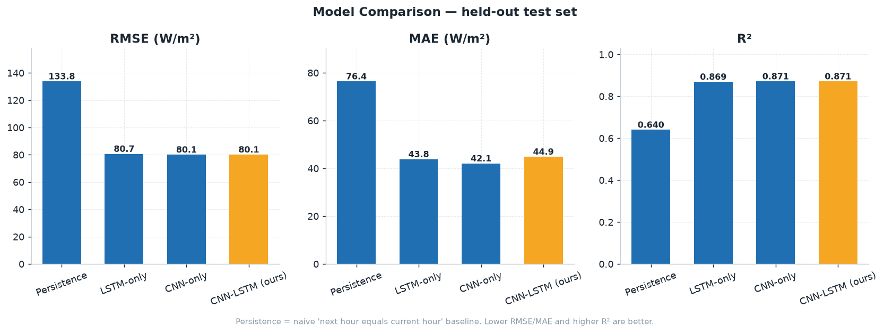
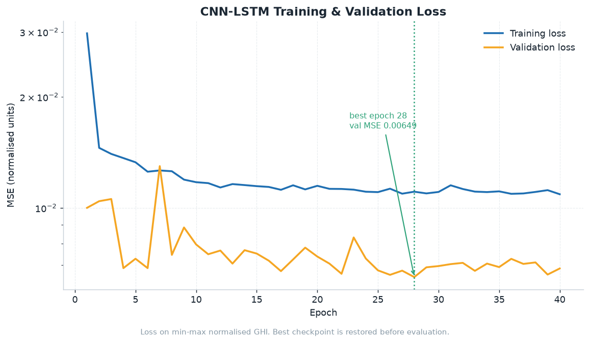
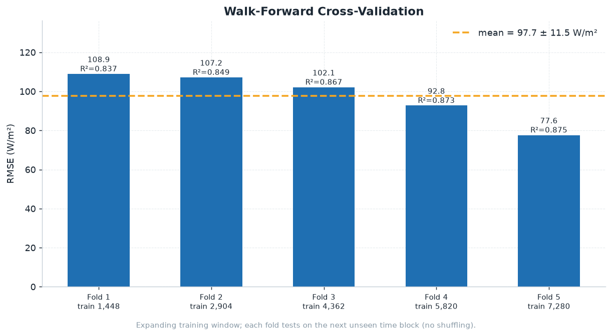
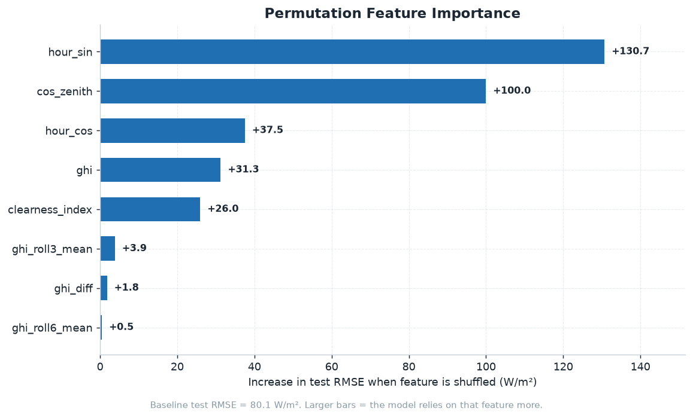
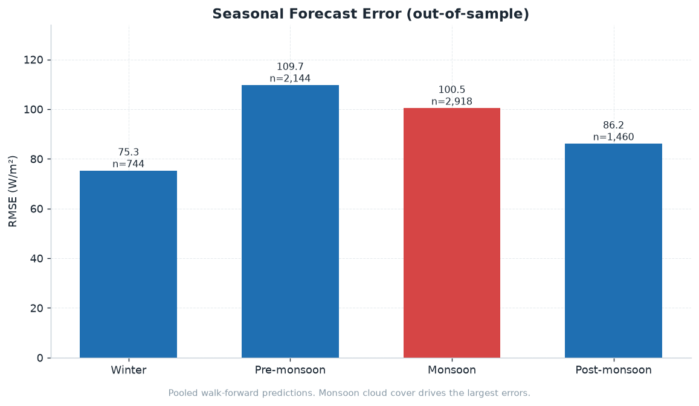
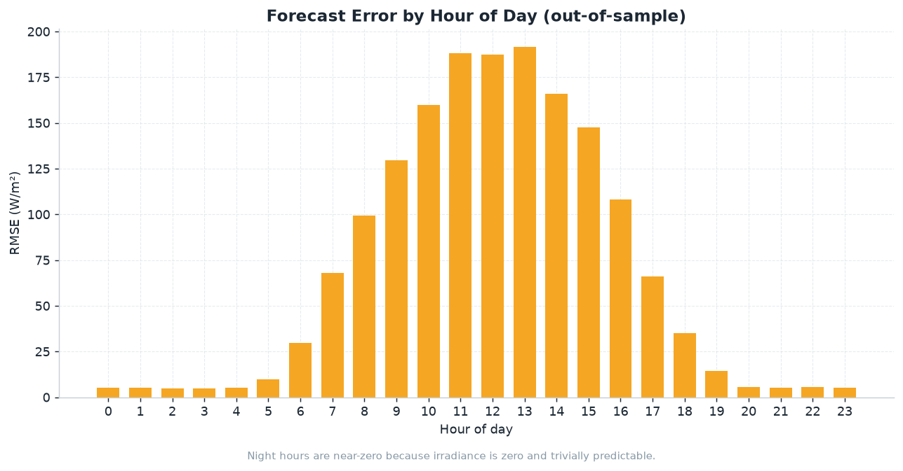
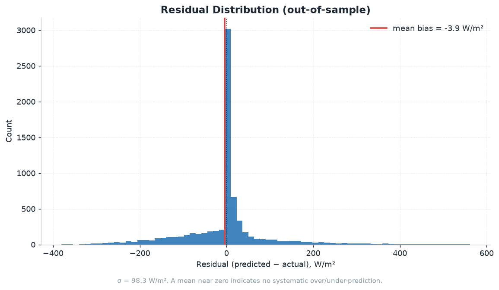
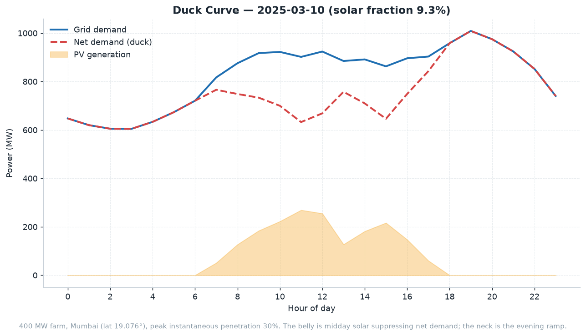
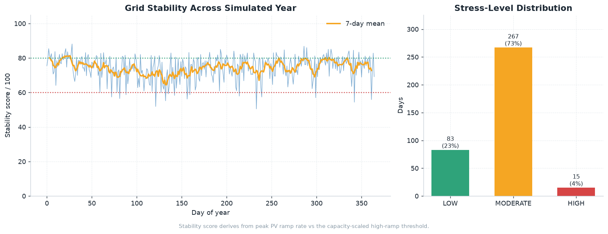

# Solar Irradiance & PV Power Prediction

Hourly global horizontal irradiance (GHI) forecasting with a CNN-LSTM hybrid,
plus duck-curve and grid-stability analysis for a utility-scale PV farm.

## Project Overview
This project predicts solar irradiance and photovoltaic (PV) power generation
using a hybrid CNN-LSTM sequence model with physics-informed features
(clearness index, solar zenith angle). It also simulates the resulting
duck-curve dynamics and ramp-driven curtailment needs on a Mumbai-shaped
demand profile.

## Research Details
**Institution**: IIT Bombay
**Duration**: December 2025 - February 2026
**Architecture**: CNN-LSTM hybrid, 24-hour look-back window

<!-- BEGIN GENERATED RESULTS -->

## Results

Measured on the bundled **synthetic** dataset (8,760 hourly rows, 2025-01-01 to 2025-12-31, 40 epochs). Full write-up in [RESULTS_AND_GRAPHS.md](RESULTS_AND_GRAPHS.md); raw values in [`results/metrics.json`](results/metrics.json).

```bash
python src/generate_results.py   # regenerates every figure and number below
```

> **On the data:** the bundled dataset is synthetic — a Spencer/Iqbal clear-sky model with stochastic monsoon-aware cloud cover, calibrated to Mumbai (lat 19.076°), so the pipeline runs out of the box. These numbers characterise model behaviour on that series, not measured-irradiance benchmark performance. Point `--data` at real observations to evaluate properly.

| Model | RMSE (W/m²) | MAE (W/m²) | R² | MAPE (%) |
|-------|-------------|------------|-----|----------|
| Persistence | 133.8 | 76.4 | 0.6401 | 76.8 |
| LSTM-only | 80.7 | 43.8 | 0.8691 | 38.7 |
| CNN-only | 80.1 | 42.1 | 0.8710 | 37.1 |
| CNN-LSTM (ours) | 80.1 | 44.9 | 0.8709 | 39.4 |

All three learned models cut RMSE by roughly **40%** against the persistence baseline. But they land within **0.6 W/m²** of each other — smaller than the fold-to-fold spread in cross-validation — so on this dataset the CNN-LSTM hybrid shows **no measurable advantage** over either single-branch ablation. Treat the three as tied, not ranked.

### Model comparison



Every model uses the same features, split, and training budget. Persistence is the naive *next hour equals current hour* baseline.

### Training convergence



Best validation loss **0.00649** at epoch **28** of 40; those weights are restored before evaluation. Validation tracks training closely, so dropout and gradient clipping are containing overfitting.

### Walk-forward cross-validation



Expanding training window, each fold tested on the next unseen time block. RMSE falls from **108.9** to **77.6 W/m²** as the training window grows — the model is data-limited, not architecture-limited.

### Feature importance



Permutation importance: each feature is shuffled and the RMSE increase recorded. Solar geometry dominates — `hour_sin` (+131 W/m²) and `cos_zenith` (+100) matter far more than the raw GHI lag.

### Seasonal error



Pooled out-of-sample predictions from the walk-forward folds. **Pre-monsoon** is hardest (109.7 W/m²), **Winter** easiest (75.3 W/m²).

### Error by hour of day



Night hours sit near zero because irradiance is zero and trivially predictable. Among daylight hours error peaks at **13:00** (191.8 W/m²).

### Residual distribution



Mean bias **-3.9 W/m²** (σ = 98.3), so no systematic over- or under-prediction. Excess kurtosis 4.2 — heavy tails from rapid cloud transients.

### Duck curve



A 400 MW farm on a Mumbai-shaped demand profile. On 2025-03-10, peak PV **269 MW** at 11:00 supplies 9.3% of daily demand; the evening ramp reaches **-128 MW/h**.

### Grid stability



Across 365 simulated days: **83** LOW stress, **267** MODERATE, **15** HIGH (mean score 74.5/100). The score scales the day's steepest PV ramp against a 160 MW/h threshold — it measures ramp severity, not reserve adequacy.

<!-- END GENERATED RESULTS -->

## Feature Engineering
### Clearness Index (Kt)
The clearness index quantifies the fraction of global solar radiation received at Earth's surface compared to the total solar radiation at the top of the atmosphere:
```
Kt = GHI / Extraterrestrial Radiation
```
This parameter helps understand atmospheric transparency and its impact on solar generation.

### Solar Zenith Angle
The solar zenith angle is the angle between the sun and a point on Earth's surface, varying throughout the day and affecting solar radiation intensity. Accurate modeling of this angle enhances prediction performance.

## Duck Curve Analysis
The duck curve illustrates daily variation in electricity demand alongside solar energy output. Our analysis includes:
- **Morning Ramp Analysis**: Peak generation period identification
- **Evening Ramp Analysis**: Rapid decline in solar generation  
- **Peak Hour Prediction**: Optimal dispatch scheduling
- **Proactive Grid Management**: Mitigating midday grid instability

## Curtailment Strategies
To balance supply and demand during peak solar output:
- **Predictive Curtailment**: Reduce generation by forecast-driven percentages
- **Ramp Management**: Proactive strategies to prevent grid instability
- **Stability Scoring**: Real-time grid stability assessment
- **High Ramp Event Detection**: Early warning system for critical events

## Installation Instructions
```bash
# Clone the repository
git clone https://github.com/pritam-09-ops/cautious-enigma.git
cd cautious-enigma

# Install dependencies
pip install -r requirements.txt
```

## Usage
```bash
# Run the complete pipeline (trains a model, forecasts, and analyzes grid stability)
python src/main.py

# Multi-day duck-curve simulation with 6-panel plot (standalone, no torch needed)
python src/duck_curve_simulation.py --date 2025-06-15 --save plots/duck_curve.png
```

## Project Structure
```
cautious-enigma/
├── src/
│   ├── main.py                  # Pipeline orchestration
│   ├── model.py                 # CNN-LSTM plus LSTM-only / CNN-only ablations
│   ├── feature_engineering.py   # Clearness Index, Zenith Angle & normalization
│   ├── train.py                 # Data prep, training loop & evaluation metrics
│   ├── predict.py               # 24-hour forecasting with MC-dropout uncertainty
│   ├── duck_curve_analysis.py   # Core grid-stability / ramp-rate analysis
│   ├── duck_curve_simulation.py # Multi-day PV/demand simulation & plotting
│   ├── generate_results.py      # Reproduces every figure & number in the report
│   └── console_utils.py         # UTF-8 safe console output
├── data/
│   └── sample_solar_data.csv    # Synthetic hourly GHI data (Mumbai-calibrated)
├── images/                      # Generated figures (do not edit by hand)
├── results/metrics.json         # Generated metrics
├── requirements.txt
└── README.md
```

## Reproducing the results

The [Results](#results) section above — every figure, table, and number — is
regenerated by a single script and should not be edited by hand:

```bash
python src/generate_results.py              # full run (~20 min on CPU)
python src/generate_results.py --quick      # fast smoke test
python src/generate_results.py --report-only  # rewrite prose from saved metrics
```

It trains the CNN-LSTM and both ablations, runs walk-forward cross-validation,
computes permutation importance, writes `images/*.png` and
`results/metrics.json`, then rewrites `RESULTS_AND_GRAPHS.md` and the generated
block in this README.

## Author
Pritam-09-ops  
IIT Bombay Research Project